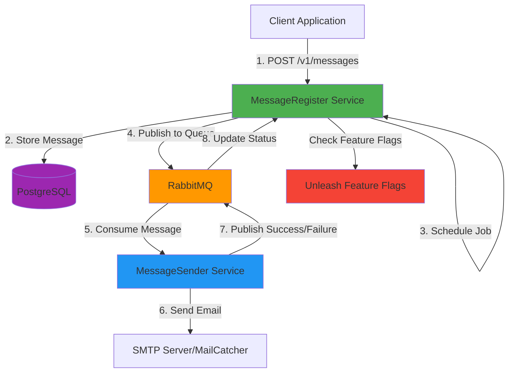
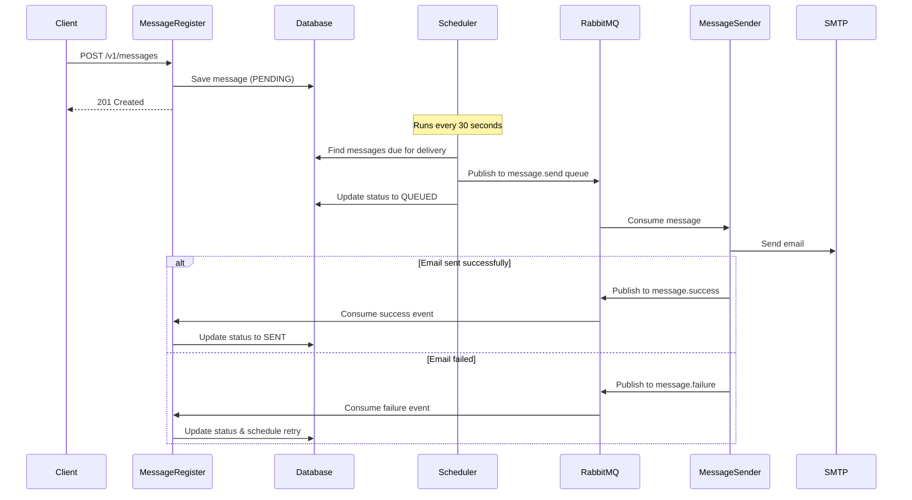
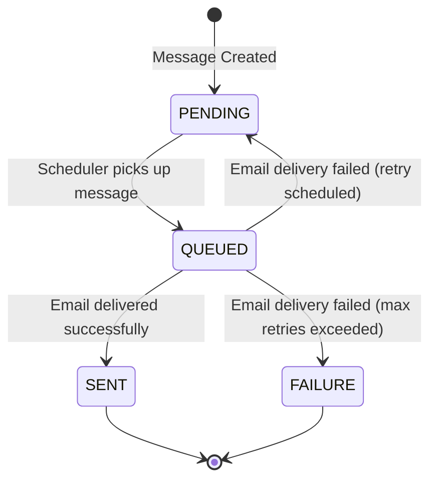

# OEMS - Over-Engineered Mail System

> ⚠️ Study Project: This is an intentionally over-engineered mail system designed for learning purposes. It demonstrates microservices architecture, message queuing, feature flags, and various Spring Boot technologies in action. There are some known issues, but I'm not planning to invest more time into fixing them right now, as the goal of the project was exploration rather than polish.

A distributed messaging system built with Spring Boot that handles scheduled message delivery through RabbitMQ. The system consists of two microservices: MessageRegister for managing messages and MessageSender for delivering them via email.

## 🏗️ Architecture



### System Components

- **MessageRegister**: REST API service for message management, scheduling, and orchestration
- **MessageSender**: Consumer service that processes messages and sends emails
- **PostgreSQL**: Primary database for message persistence
- **RabbitMQ**: Message broker for asynchronous communication
- **MailCatcher**: SMTP server for email testing (development)
- **Unleash**: Feature flag management system

## ✨ Features

- **Scheduled Message Delivery**: Schedule messages for future delivery with precise timing
- **Automatic Retry Mechanism**: Built-in retry logic with exponential backoff
- **Status Tracking**: Track message lifecycle (PENDING → QUEUED → SENT/FAILURE)
- **Feature Flags**: Dynamic feature control via Unleash
- **Pagination Support**: Efficient message listing with customizable page size
- **Validation**: Comprehensive input validation for all API requests

## 🔧 Prerequisites

- Java 25
- Maven 3.8+
- Docker & Docker Compose

## 🚀 Quick Start

### Option 1: Development Mode (Manual)

Perfect for development with hot reload and debugging.

#### 1. Start Infrastructure Services

```bash
docker-compose up -d
```

This will start:
- PostgreSQL (port 5433)
- RabbitMQ (ports 5672, 15672)
- MailCatcher (ports 1025, 1080)
- Unleash (port 4242)

#### 2. Start MessageRegister Service

```bash
cd MessageRegister
./mvnw spring-boot:run
```

The service will be available at `http://localhost:8080`

#### 3. Start MessageSender Service

```bash
cd MessageSender
./mvnw spring-boot:run
```

#### 4. Access Web Interfaces

- **RabbitMQ Management**: http://localhost:15672 (guest/guest)
- **MailCatcher**: http://localhost:1080
- **Unleash**: http://localhost:4242 (admin/unleash4all)

## 📚 API Documentation

### Base URL

```
http://localhost:8080/v1/messages
```

### Endpoints

#### Create Message

Create a new scheduled message.

**Request:**
```http
POST /v1/messages
Content-Type: application/json

{
  "body": "Your message content here",
  "email": "recipient@example.com",
  "userId": "26c631c3-57b5-41c7-beb9-bc44de1f53f7",
  "scheduledTime": "2025-11-21T15:30:00Z"
}
```

**Response:** `201 Created`
```json
{
  "id": "e7b7e94b-65d9-4a9b-9f9d-8ffffb4c6e70",
  "body": "Your message content here",
  "email": "recipient@example.com",
  "userId": "26c631c3-57b5-41c7-beb9-bc44de1f53f7",
  "scheduledTime": "2025-11-21T15:30:00Z",
  "status": "PENDING",
  "retryCount": 0,
  "createdAt": "2025-11-21T10:00:00Z",
  "updatedAt": "2025-11-21T10:00:00Z"
}
```

**Validation Rules:**
- `body`: Required, 1-1000 characters
- `email`: Required, valid email format
- `userId`: Required, valid UUID
- `scheduledTime`: Required, ISO 8601 format

#### Get Message by ID

Retrieve a specific message by its ID.

**Request:**
```http
GET /v1/messages/{id}
```

**Response:** `200 OK`
```json
{
  "id": "e7b7e94b-65d9-4a9b-9f9d-8ffffb4c6e70",
  "body": "Your message content here",
  "email": "recipient@example.com",
  "userId": "26c631c3-57b5-41c7-beb9-bc44de1f53f7",
  "scheduledTime": "2025-11-21T15:30:00Z",
  "status": "SENT",
  "retryCount": 0,
  "queuedAt": "2025-11-21T15:30:00Z",
  "createdAt": "2025-11-21T10:00:00Z",
  "updatedAt": "2025-11-21T15:30:05Z"
}
```

**Response:** `404 Not Found` (if message doesn't exist)

#### List All Messages

Retrieve paginated list of messages.

**Request:**
```http
GET /v1/messages?page=0&size=20&sort=scheduledTime,desc
```

**Query Parameters:**
- `page`: Page number (default: 0)
- `size`: Page size (default: 20)
- `sort`: Sort field and direction (e.g., `scheduledTime,desc`)

**Response:** `200 OK`
```json
{
  "content": [
    {
      "id": "e7b7e94b-65d9-4a9b-9f9d-8ffffb4c6e70",
      "body": "Message 1",
      "email": "user1@example.com",
      "userId": "26c631c3-57b5-41c7-beb9-bc44de1f53f7",
      "scheduledTime": "2025-11-21T15:30:00Z",
      "status": "SENT",
      "retryCount": 0,
      "createdAt": "2025-11-21T10:00:00Z",
      "updatedAt": "2025-11-21T15:30:05Z"
    }
  ],
  "pageable": {
    "pageNumber": 0,
    "pageSize": 20
  },
  "totalElements": 1,
  "totalPages": 1,
  "last": true
}
```

## 🔄 Message Flow



### Message Status Lifecycle



### Status Descriptions

- **PENDING**: Message created and waiting to be scheduled
- **QUEUED**: Message sent to RabbitMQ for processing
- **SENT**: Email successfully delivered
- **FAILURE**: Email delivery failed after all retry attempts

## 🎚️ Unleash Feature Flags Configuration

| Flag Name | Description | Default State | Used In |
|-----------|-------------|---------------|---------|
| `email-send` | Controls whether emails can be sent | ❌ Disabled    | MessageRegister |
| `debug-logging` | Module-level debug logging (context: module) | ❌ Disabled    | MessageRegister |
| `debug-logging-global` | Global debug logging across all modules | ❌ Disabled    | MessageRegister |

### Manual Setup

If you prefer to configure manually:

1. Navigate to http://localhost:4242
2. Login with default credentials: `admin` / `unleash4all`
3. The API tokens are pre-configured in `docker-compose.yml`:
   - Frontend token: `*:development.unleash-insecure-frontend-token`
   - Client token: `*:development.unleash-insecure-api-token`
4. Create the feature flags listed in the table above

### How Feature Flags Are Used

**In the code (MessageRegister/src/main/java/.../config/UnleashService.java:18-41):**

```java
// Check if email sending is enabled for specific user
boolean canSend = unleashService.isEmailSendEnabled(userId, email);

// Check if debug logging is enabled for a module
boolean debugEnabled = unleashService.isDebugLoggingEnabled("dev.yaansz.scheduler");

// Check if global debug logging is enabled
boolean globalDebug = unleashService.isDebugLoggingEnabledGlobally();
```

**Use cases:**
- **`email-send`**: Emergency kill switch to stop all email sending
- **`debug-logging`**: Troubleshoot specific modules without flooding logs
- **`debug-logging-global`**: Enable detailed logging across the entire system